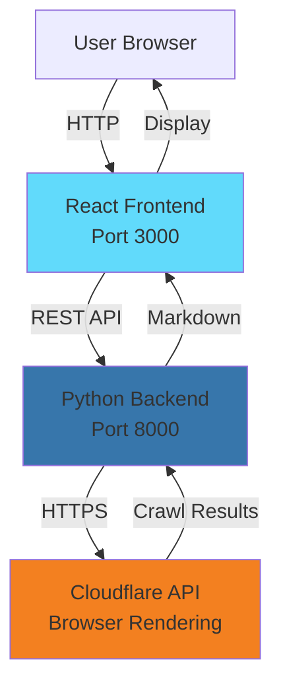
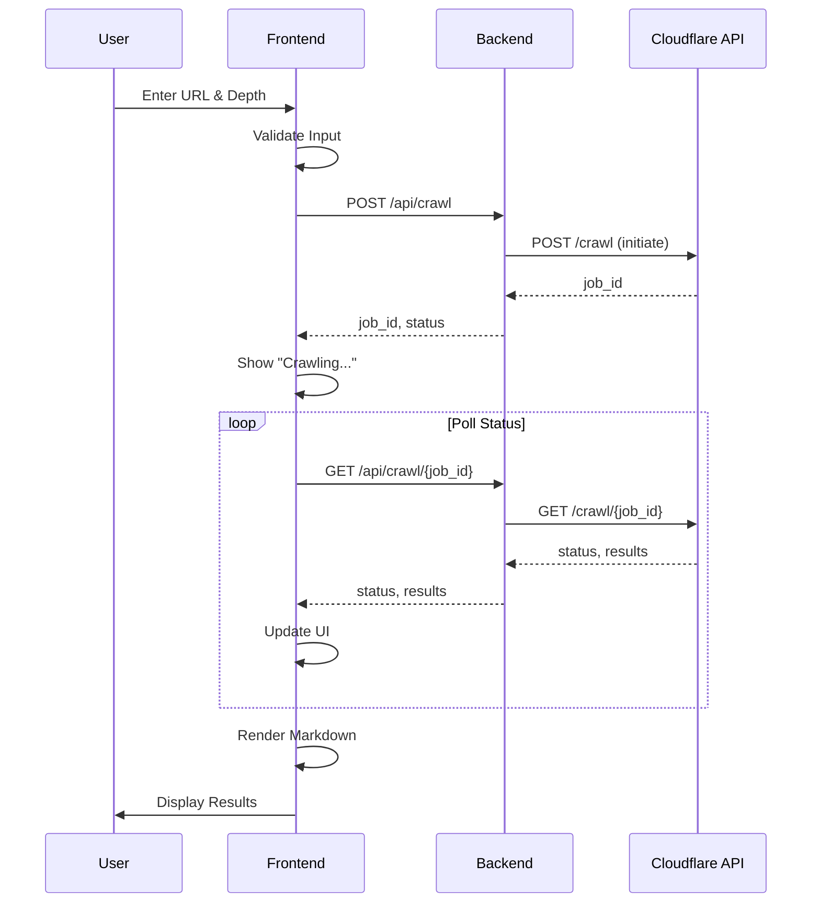
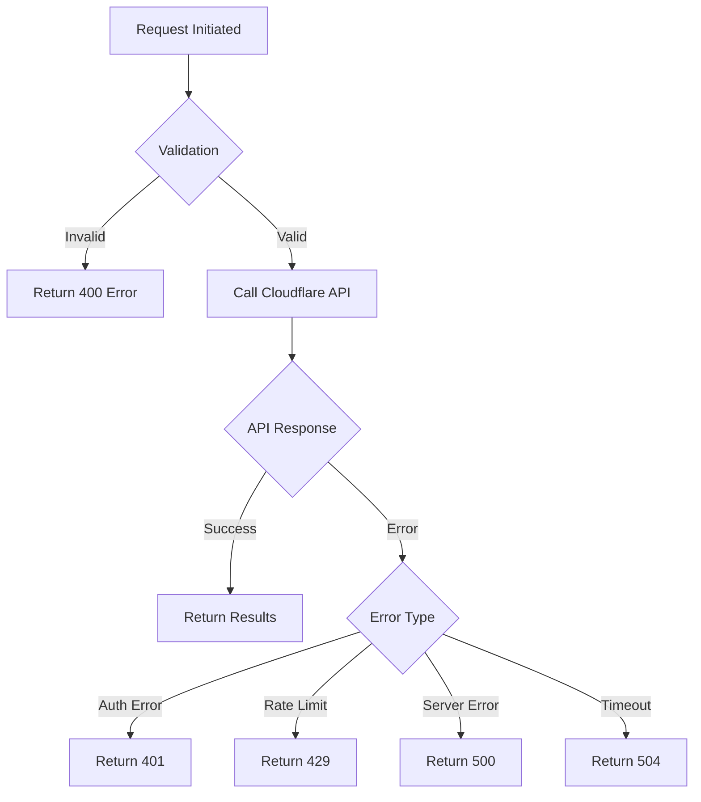
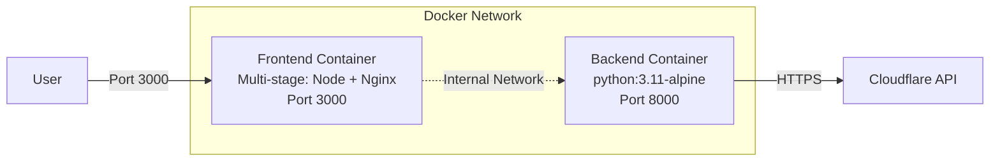

# Web Crawler Application Architecture

## Overview

A simple web application that allows users to crawl websites using Cloudflare's Browser Rendering API. The application consists of a React frontend and Python backend, both containerized with Docker.

## System Architecture



## Technology Stack

### Frontend
- **Framework**: React 18.2
- **Build Tool**: Vite 5.0
- **HTTP Client**: Axios 1.6
- **Markdown Renderer**: react-markdown 9.0
- **Styling**: CSS Modules
- **Container**: Multi-stage (Node.js build, Nginx serve)

### Backend
- **Framework**: FastAPI 0.109 (Python 3.11+)
- **HTTP Client**: httpx 0.26 (async support)
- **Validation**: Pydantic 2.5
- **Configuration**: pydantic-settings 2.1
- **CORS**: FastAPI CORSMiddleware
- **Environment**: python-dotenv 1.0
- **Server**: Uvicorn 0.27
- **Container**: Python Alpine image

### Infrastructure
- **Orchestration**: Docker Compose
- **Networking**: Bridge network for service communication

## Component Design

### 1. React Frontend

#### Components Structure
```
src/
├── components/
│   ├── CrawlForm.jsx          # URL and depth input form
│   ├── MarkdownViewer.jsx     # Displays crawl results
│   ├── StatusIndicator.jsx    # Shows crawl job status
│   └── ErrorDisplay.jsx       # Error handling UI
├── services/
│   └── api.js                 # Backend API client
├── App.jsx                    # Main application
└── main.jsx                   # Entry point
```

#### Key Features
- Form validation for URL and depth inputs
- Real-time status updates during crawling
- Markdown rendering with syntax highlighting
- Error handling and user feedback
- Responsive design

### 2. Python Backend

#### API Structure
```
app/
├── main.py                    # FastAPI application entry point
├── models.py                  # Pydantic models for validation
├── cloudflare_client.py       # Cloudflare API integration
├── config.py                  # Configuration management
├── api/                       # API layer
│   ├── __init__.py
│   ├── routes.py              # API route definitions
│   └── exception_handlers.py # Custom exception handlers
└── services/                  # Business logic layer
    ├── __init__.py
    └── crawl_service.py       # Crawl operations service
```

#### API Endpoints

**POST /api/crawl**
- **Purpose**: Initiate a crawl job
- **Status Code**: 202 Accepted
- **Request Body**:
  ```json
  {
    "url": "https://example.com",
    "depth": 2
  }
  ```
- **Response**:
  ```json
  {
    "job_id": "uuid-string",
    "status": "running"
  }
  ```
- **Error Responses**: 400 (Invalid request), 401 (Invalid credentials), 429 (Rate limit), 502 (Cloudflare API error)

**GET /api/crawl/{job_id}**
- **Purpose**: Get crawl job status and results
- **Response**:
  ```json
  {
    "job_id": "uuid-string",
    "status": "completed",
    "total": 50,
    "finished": 50,
    "browser_seconds_used": 12.5,
    "results": [
      {
        "url": "https://example.com/page",
        "status": "completed",
        "markdown": "# Content...",
        "metadata": {
          "status": 200,
          "title": "Page Title",
          "url": "https://example.com/page"
        }
      }
    ],
    "cursor": null
  }
  ```
- **Error Responses**: 404 (Job not found), 401 (Invalid credentials), 502 (Cloudflare API error)

**GET /api/health**
- **Purpose**: Health check endpoint
- **Response**: `{"status": "healthy"}`

## Data Flow

### Crawl Workflow



### Error Handling Flow



## Configuration

### Environment Variables

**Backend (.env)**
```bash
CLOUDFLARE_ACCOUNT_ID=your_account_id
CLOUDFLARE_API_TOKEN=your_api_token
CORS_ORIGINS=http://localhost:3000
PORT=8000
```

**Frontend (.env)**
```bash
VITE_API_URL=http://localhost:8000
```

## Docker Architecture

### Container Strategy



### Build Strategy

**Multi-stage Builds**
- Frontend: Build with Node, serve with Nginx
- Backend: Install dependencies, run with Uvicorn

**Image Optimization**
- Use Alpine base images
- Multi-stage builds to reduce size
- Layer caching for dependencies
- .dockerignore for unnecessary files

## Security Considerations

### API Security
- API token stored in environment variables (not in code)
- CORS configured for frontend origin only
- Input validation on both frontend and backend
- Rate limiting on backend endpoints

### Container Security
- Non-root user in containers
- Read-only file systems where possible
- No sensitive data in images
- Environment variables for secrets

## Scalability Considerations

### Current Design (Simple)
- Single backend instance
- Polling for job status
- In-memory job tracking

### Future Enhancements (If Needed)
- Redis for job queue and caching
- WebSocket for real-time updates
- Multiple backend workers
- Database for job history
- Authentication/authorization

## Development Workflow

### Local Development
```bash
# Backend
cd backend
python -m venv venv
source venv/bin/activate
pip install -r requirements.txt
uvicorn app.main:app --reload

# Frontend
cd frontend
npm install
npm run dev
```

### Docker Development
```bash
docker-compose up --build
```

### Production Deployment
```bash
docker-compose -f docker-compose.prod.yml up -d
```

## API Rate Limiting Strategy

### Cloudflare Limits
- Free tier: 10 minutes browser time/day
- Max 100,000 pages per crawl
- 7-day max job runtime

### Application Strategy
- Track usage in backend
- Return clear error messages when limits approached
- Implement request queuing if needed
- Cache results for repeated URLs (optional)

## Monitoring & Logging

### Backend Logging
- Request/response logging
- Cloudflare API call logging
- Error tracking with stack traces
- Performance metrics (response times)

### Frontend Logging
- User action tracking
- API error logging
- Console warnings for development

## Testing Strategy

### Backend Tests
- Unit tests for Cloudflare client
- Integration tests for API endpoints
- Mock Cloudflare API responses
- Validation tests for input models

### Frontend Tests
- Component unit tests
- Integration tests for API calls
- E2E tests for crawl workflow
- Accessibility tests

## Deployment Checklist

- [ ] Environment variables configured
- [ ] Cloudflare API credentials valid
- [ ] Docker images built successfully
- [ ] CORS origins configured correctly
- [ ] Health check endpoints responding
- [ ] Error handling tested
- [ ] Documentation complete
- [ ] README with setup instructions

## Project Structure

```
crawl-site/
├── backend/
│   ├── app/
│   │   ├── __init__.py
│   │   ├── main.py                    # FastAPI application entry point
│   │   ├── models.py                  # Pydantic models
│   │   ├── cloudflare_client.py       # Cloudflare API integration
│   │   ├── config.py                  # Configuration management
│   │   ├── api/                       # API layer
│   │   │   ├── __init__.py
│   │   │   ├── routes.py              # API route definitions
│   │   │   └── exception_handlers.py  # Custom exception handlers
│   │   └── services/                  # Business logic layer
│   │       ├── __init__.py
│   │       └── crawl_service.py       # Crawl operations service
│   ├── tests/                         # Backend tests (to be implemented)
│   ├── requirements.txt               # Python dependencies
│   ├── Dockerfile                     # Backend container definition
│   └── .env.example                   # Environment variables template
├── frontend/
│   ├── src/
│   │   ├── components/                # React components
│   │   │   ├── CrawlForm.jsx          # URL/depth input form
│   │   │   ├── CrawlForm.css          # Form styles
│   │   │   ├── StatusIndicator.jsx    # Crawl progress display
│   │   │   ├── StatusIndicator.css    # Status styles
│   │   │   ├── MarkdownViewer.jsx     # Results viewer
│   │   │   ├── MarkdownViewer.css     # Viewer styles
│   │   │   ├── ErrorDisplay.jsx       # Error handling UI
│   │   │   └── ErrorDisplay.css       # Error styles
│   │   ├── services/
│   │   │   └── api.js                 # Backend API client
│   │   ├── App.jsx                    # Main application component
│   │   ├── App.css                    # Global styles
│   │   └── main.jsx                   # React entry point
│   ├── public/                        # Static assets
│   ├── index.html                     # HTML template
│   ├── package.json                   # Node dependencies
│   ├── vite.config.js                 # Vite configuration
│   ├── Dockerfile                     # Frontend container definition
│   ├── nginx.conf                     # Nginx configuration
│   └── .env.example                   # Environment variables template
├── .bob/                              # Bob AI configuration
├── docker-compose.yml                 # Multi-container orchestration
├── .gitignore                         # Git ignore patterns
├── README.md                          # User documentation
├── ARCHITECTURE.md                    # This file - Architecture documentation
└── AGENTS.md                          # Developer guidance for AI agents
```

## Implementation Status

✅ **Completed Components:**
- Backend API with FastAPI (layered architecture)
- Frontend React application with Vite
- Cloudflare Browser Rendering API integration
- Docker containerization with multi-stage builds
- CORS configuration and security measures
- Comprehensive error handling
- Real-time status polling
- Markdown rendering with collapsible sections

🔄 **Future Enhancements:**
- Unit and integration tests
- WebSocket for real-time updates (instead of polling)
